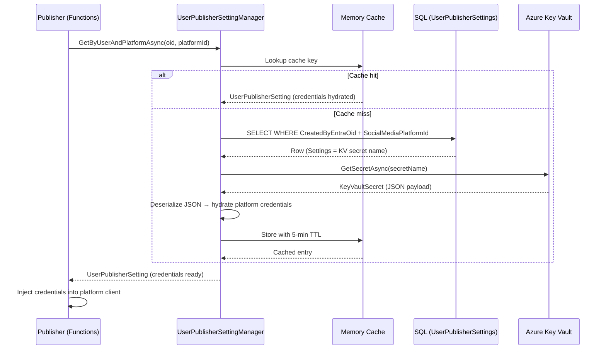

# Per-User Credential Handling

This document describes how user-specific credentials and collector configuration are stored,
resolved, and rotated in the JJGNet Broadcasting system. Target audience: developers
maintaining or extending the platform.

## Overview

The system uses a **per-user credential model**. Each user's social media credentials and
collector configuration are stored separately, keyed to their Entra Object ID (OID).
Sensitive values — API keys, tokens, secrets, and passwords — are **never stored in
plaintext in the database**. The database holds only a Key Vault secret name; Azure Key
Vault holds the actual credential payload.

## Publisher Credential Storage Architecture

### Database layer

`UserPublisherSettings` stores one row per user per platform.

| Column | Type | Purpose |
|---|---|---|
| `Id` | `int identity` | Surrogate primary key |
| `CreatedByEntraOid` | `nvarchar(36)` | User's Entra Object ID (OID) |
| `SocialMediaPlatformId` | `int` | FK to `SocialMediaPlatforms` |
| `IsEnabled` | `bit` | Whether the publisher is active for this user |
| `Settings` | `nvarchar(max)` | JSON containing the **Key Vault secret name** for this user+platform |
| `CreatedOn` / `LastUpdatedOn` | `datetimeoffset` | Audit timestamps |

The unique constraint `UQ_UserPublisherSettings_User_Platform` ensures at most one row per
`(CreatedByEntraOid, SocialMediaPlatformId)` pair.

### Key Vault layer

The value stored in `Settings` is **not** the credential itself — it is the name of an
Azure Key Vault secret. The secret value is a JSON object containing all sensitive fields
for that platform and user.

Secret naming convention: `publisher-{platform}-{oid}`

Examples:

```text
publisher-twitter-abc123-oid-goes-here
publisher-linkedin-abc123-oid-goes-here
publisher-bluesky-abc123-oid-goes-here
publisher-facebook-abc123-oid-goes-here
```

### Write-only fields

`UserPublisherSetting.WriteOnlyFields` lists the credential field names for that platform.
The API and Web layers use this list to ensure sensitive fields are never returned in
responses — they accept the values on write but omit them on read.

### Credential resolution at runtime

`IKeyVault.GetSecretAsync(secretName)` fetches the credential JSON from Key Vault.
`IKeyVault.UpdateSecretValueAndPropertiesAsync(secretName, secretValue, expiresOn)` stores
or rotates it (disables the previous version, creates a new version, sets expiry).

`UserPublisherSettingManager` applies a **5-minute memory cache** over Key Vault calls to
bound call volume. Cache entries are evicted after 5 minutes; the next call fetches a fresh
value automatically.

### Credential resolution flow



## Collector Configuration Storage

Non-sensitive per-user collector configuration is stored directly in the database. No Key
Vault involvement is needed because feed URLs, channel IDs, and file paths are not
credentials.

| Table | What it stores |
|---|---|
| `UserCollectorSpeakingEngagements` | Speaking engagement file URL per user |
| `UserCollectorScheduledItems` | Scheduled item publishing config per user |

All collector tables share the same shape:

- `CreatedByEntraOid` — identifies the owning user
- `IsActive` — toggles collection without deleting the row
- `CreatedOn` / `LastUpdatedOn` — `datetimeoffset` audit timestamps

> **Note:** RSS/Atom feed sources are stored in `SyndicationFeedSources` (shared, not
> per-user) and YouTube channel sources in `YouTubeSources`. The `UserCollector*` tables
> capture per-user *enablement and configuration* of those sources.

## Security Rationale

| Concern | Approach |
|---|---|
| OWASP A04 — Cryptographic Failures | Credentials are never stored in plaintext DB columns |
| Encryption at rest | Key Vault encrypts secret values; SQL Server TDE covers the `Settings` column (which contains only a secret name, not the value) |
| Access control | Key Vault access is governed by Managed Identity / RBAC; the app gets only `Secret Get` permission |
| Audit trail | Key Vault logs every `GetSecret` call; secret versions are preserved when rotated |
| Secret rotation | Update the Key Vault secret value; no code changes or deployments needed |
| KV call volume | 5-minute cache bounds calls to ~12 per hour per user per platform |
| Scale | One secret per user per platform — supports hundreds of users without structural changes |

## Key Vault Secret Naming Convention

| Platform | Secret Name Pattern | Credential Fields |
|---|---|---|
| Twitter | `publisher-twitter-{oid}` | `ConsumerKey`, `ConsumerSecret`, `OAuthToken`, `OAuthTokenSecret` |
| LinkedIn | `publisher-linkedin-{oid}` | `ClientId`, `ClientSecret`, `AccessToken`, `AuthorId`, `AccessTokenUrl` |
| Bluesky | `publisher-bluesky-{oid}` | `BlueskyUserName`, `BlueskyPassword` |
| Facebook | `publisher-facebook-{oid}` | `AppId`, `AppSecret`, `ClientToken`, `PageId`, `PageAccessToken`, `LongLivedAccessToken`, `ShortLivedAccessToken`, `GraphApiVersion`, `GraphApiRootUrl` |

Replace `{oid}` with the user's Entra Object ID (UUID format, e.g.,
`a1b2c3d4-1234-5678-abcd-ef0123456789`).

## Adding a New User's Publisher Credentials

1. **Obtain the user's Entra OID.** In the Azure Portal, navigate to Entra ID → Users →
   select the user → copy the *Object ID*.

2. **Create the Key Vault secret.** In the Azure Portal (or via the Azure CLI), create a
   new secret named `publisher-{platform}-{oid}` whose value is a JSON object containing
   all credential fields for the platform. Example for Bluesky:

   ```json
   {
     "BlueskyUserName": "user.bsky.social",
     "BlueskyPassword": "app-password-here"
   }
   ```

   Set an appropriate expiry date to enforce rotation.

3. **Insert the `UserPublisherSettings` row.** Use the API (`POST /api/UserPublisherSettings`)
   or directly insert via the management UI. The `Settings` field should contain the JSON
   object with the secret name:

   ```json
   { "SecretName": "publisher-bluesky-a1b2c3d4-1234-5678-abcd-ef0123456789" }
   ```

4. **Enable the setting.** Set `IsEnabled = true` either via the API or the Web UI. The
   publisher will not activate until this is true.

5. **Verify.** Trigger a test publish or check the Functions app logs to confirm credentials
   resolve without errors.

## Secret Rotation

To rotate credentials for a user and platform:

1. **Update the Key Vault secret.** Call `IKeyVault.UpdateSecretValueAndPropertiesAsync`
   (or update directly in the Azure Portal). This disables the current secret version and
   creates a new version with the updated credential JSON. Set a new expiry date.

2. **Wait up to 5 minutes.** The in-process memory cache TTL is 5 minutes. After expiry
   the next credential lookup will fetch the updated secret automatically. No deployment
   is required.

3. **Force immediate refresh (optional).** Restart the Functions app. This clears the
   memory cache and forces a fresh Key Vault fetch on the next invocation.

4. **Verify.** Check the Functions app structured logs to confirm the new credentials are
   accepted by the platform.

> **Tip:** Key Vault secret expiry notifications can be configured via Event Grid or
> Azure Monitor alerts. Set alerts to fire 30 days before expiry to allow rotation
> before credentials become invalid.
