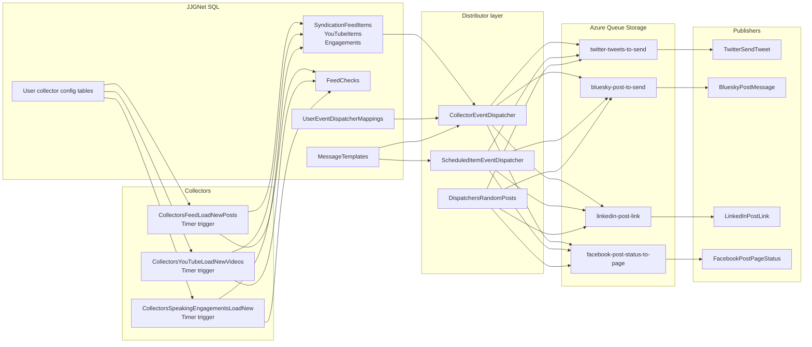
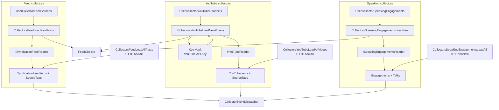
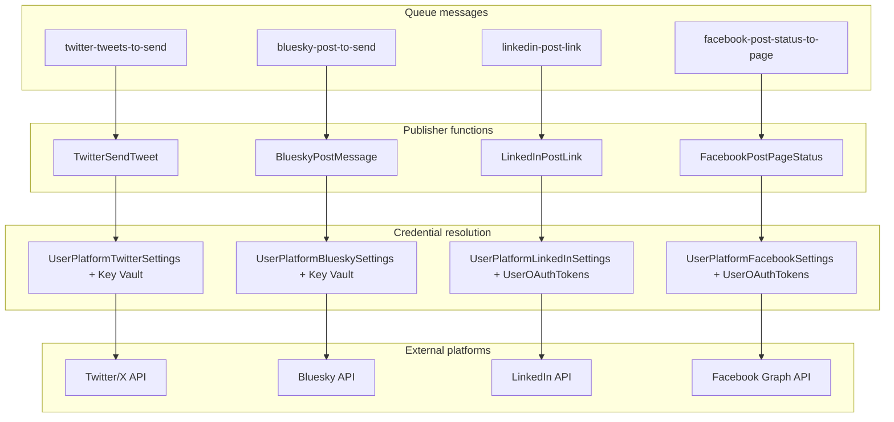
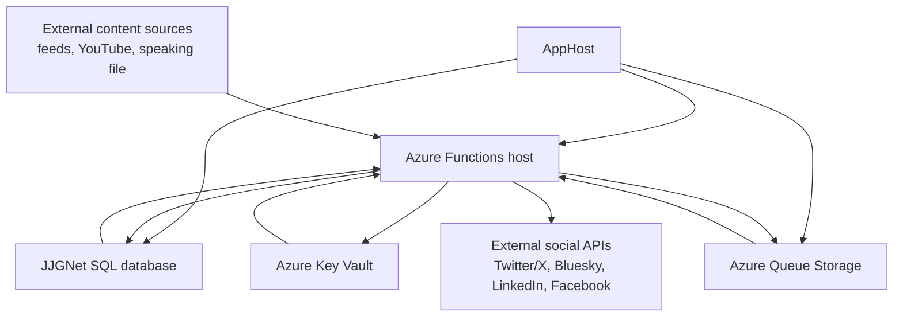

<!-- markdownlint-disable MD013 -->
# Collector, distributor, and publisher flow

> [!NOTE]
> This document describes the current code path in `src\JosephGuadagno.Broadcasting.Functions`. The legacy Event Grid fan-out has been removed from the active collector and scheduled-item pipeline. Individual Mermaid flow docs for the current collectors and dispatchers now live in this same folder.

## Overview

The broadcasting pipeline has three stages:

1. **Collectors** poll external sources, normalize content, and persist it to SQL.
2. **Distributors** decide which user/platform combinations should receive each event, compose platform-specific text, and enqueue a `SocialMediaPublishRequest`.
3. **Publishers** consume platform queues, resolve user credentials, and call the external social API.

The current implementation is **user-aware at every stage**. Collector functions run once on a schedule, but they process per-user collector configurations. Distributor services route by `CreatedByEntraOid` plus `UserEventDispatcherMappings`, so one user's blog post can go to LinkedIn and Bluesky while another user's video only goes to Twitter.

---

## High-level flow

## Collector stage

Collectors are Azure Functions that run on timers and read **per-user collector configuration** from SQL. Each collector saves only new content, updates `FeedChecks`, and then hands each saved item to `CollectorEventDispatcher` for per-user routing.

### Collector flow

### Collector responsibilities

| Collector | Trigger | Source | What it saves | What it emits |
| --- | --- | --- | --- | --- |
| `CollectorsFeedLoadNewPosts` | Timer `%collectors_feed_load_new_posts_cron_settings%` | User-configured feed URL | `SyndicationFeedItems`, `SourceTags`, `FeedChecks` | `NewSyndicationFeedItem` via `CollectorEventDispatcher` |
| `CollectorsYouTubeLoadNewVideos` | Timer `%collectors_youtube_load_new_videos_cron_settings%` | User-configured YouTube playlist/channel and per-user API key | `YouTubeItems`, `SourceTags`, `FeedChecks` | `NewYouTubeItem` via `CollectorEventDispatcher` |
| `CollectorsSpeakingEngagementsLoadNew` | Timer `%collectors_speaking_engagements_load_new_speaking_engagements_cron_settings%` | User-configured speaking engagements file | `Engagements`, `Talks`, `FeedChecks` | `NewSpeakingEngagement` via `CollectorEventDispatcher` |
| `CollectorsFeedLoadAllPosts` | Anonymous HTTP POST | Same feed source, manual backfill | `SyndicationFeedItems`, `FeedChecks` | No automatic publish |
| `CollectorsYouTubeLoadAllVideos` | Anonymous HTTP POST | Same YouTube source, manual backfill | `YouTubeItems`, `FeedChecks` | No automatic publish |
| `CollectorsSpeakingEngagementsLoadAll` | Anonymous HTTP POST | Same speaking source, manual backfill | `Engagements`, `Talks`, `FeedChecks` | No automatic publish |

### Collector notes

- `LoadNewPosts` and `LoadNewVideos` shorten canonical URLs before save.
- `LoadNewVideos` resolves the YouTube API key from Key Vault through `UserCollectorYouTubeChannelManager`.
- All three timer-based collectors use uniqueness checks before save, then dispatch only newly persisted items.
- Individual Mermaid flow docs in this folder cover the current collector and dispatcher paths:
  - [collector-feed-load-new-posts.md](collector-feed-load-new-posts.md)
  - [collector-feed-load-all-posts.md](collector-feed-load-all-posts.md)
  - [collector-youtube-load-new-videos.md](collector-youtube-load-new-videos.md)
  - [collector-youtube-load-all-videos.md](collector-youtube-load-all-videos.md)
  - [collector-speaking-engagements-load-new.md](collector-speaking-engagements-load-new.md)
  - [collector-speaking-engagements-load-all.md](collector-speaking-engagements-load-all.md)
  - [distributor-collector-event.md](distributor-collector-event.md)
  - [distributor-scheduled-items.md](distributor-scheduled-items.md)
  - [distributor-random-posts.md](distributor-random-posts.md)

---

## Distributor stage

The distributor stage is the routing brain of the system. It converts a saved item or scheduled event into one or more queue messages by combining three inputs:

- the **event type** (`NewSyndicationFeedItem`, `NewYouTubeItem`, `NewSpeakingEngagement`, `RandomPost`, `ScheduledItem`)
- the owner's active **`UserEventDistributorMappings`**
- the owner's per-platform **`MessageTemplates`**

`PostComposer` renders the final text, then the distributor writes a fresh `SocialMediaPublishRequest` into the platform queue. This is the point where the system fans out from one saved item to many publisher targets.

### Routing rules

| Event type | Producer | Distributor | Queue decision source |
| --- | --- | --- | --- |
| `NewSyndicationFeedItem` | `CollectorsFeedLoadNewPosts` | `CollectorEventDistributor.DispatchSyndicationFeedItemAsync` | `UserEventDistributorMappings` + `MessageTemplates` |
| `NewYouTubeItem` | `CollectorsYouTubeLoadNewVideos` | `CollectorEventDistributor.DispatchYouTubeItemAsync` | `UserEventDistributorMappings` + `MessageTemplates` |
| `NewSpeakingEngagement` | `CollectorsSpeakingEngagementsLoadNew` | `CollectorEventDistributor.DispatchSpeakingEngagementAsync` | `UserEventDistributorMappings` + `MessageTemplates` |
| `ScheduledItem` | `DistributorsScheduledItems` | `ScheduledItemEventDistributor.DispatchAsync` | `UserEventDistributorMappings` + `MessageTemplates` |
| `RandomPost` | `DispatchersRandomPosts` | In-function queue routing | `UserRandomPostSettings` + `MessageTemplates` |

### Scheduled and random distribution

- `DistributorsScheduledItems` polls due `ScheduledItems`, builds a publish request from the referenced source item type, distributes through `ScheduledItemEventDistributor`, and then marks the item as sent.
- `DistributorsRandomPosts` polls due `UserRandomPostSettings`, picks a random syndication item for that owner, composes text immediately, enqueues it, and advances `NextRunDateUtc`.
- The current implementation has **no active Event Grid hop** in this path. Routing is direct from distributor code to Azure Storage queues.

---

## Publisher stage

Publisher functions are queue-triggered Azure Functions. Each one receives a `SocialMediaPublishRequest`, enriches it with the owner's credentials, and calls the platform-specific manager.

### Publisher flow

### Publisher responsibilities

| Publisher | Trigger | Configuration it resolves | Publish target |
| --- | --- | --- | --- |
| `TwitterSendTweet` | Queue `twitter-tweets-to-send` | `UserPlatformTwitterSettings` plus consumer/access secrets from Key Vault | Twitter/X |
| `BlueskyPostMessage` | Queue `bluesky-post-to-send` | `UserPlatformBlueskySettings` plus app password from Key Vault | Bluesky |
| `LinkedInPostLink` | Queue `linkedin-post-link` | `UserPlatformLinkedInSettings` plus access token from `UserOAuthTokens` | LinkedIn |
| `FacebookPostPageStatus` | Queue `facebook-post-status-to-page` | `UserPlatformFacebookSettings` plus access token from `UserOAuthTokens` | Facebook |

### Publisher support functions

| Function | Trigger | Role |
| --- | --- | --- |
| `FacebookTokenRefresh` | Timer `%facebook_refresh_tokens_cron_settings%` | Refreshes expiring Facebook OAuth tokens and writes them back to `UserOAuthTokens` |
| `LinkedInNotifyExpiringTokens` | Timer `%linkedin_notify_expiring_tokens_cron_settings%` | Emails users before LinkedIn tokens expire |

---

## Data flow and component interaction

### Interaction summary

| Layer | Primary code | Reads from | Writes to |
| --- | --- | --- | --- |
| Collector input | `ISyndicationFeedReader`, `IYouTubeReader`, `ISpeakingEngagementsReader` | External source endpoints/files, user collector config, Key Vault for YouTube API key | In-memory source models |
| Persistence | `ISyndicationFeedItemManager`, `IYouTubeItemManager`, `IEngagementManager`, `IFeedCheckManager` | Domain models from readers | SQL content tables and `FeedChecks` |
| Distribution | `CollectorEventDistributor`, `ScheduledItemEventDistributor`, `DistributorsRandomPosts` | SQL routing tables and templates | Azure Storage queues |
| Publishing | Queue-trigger functions and platform managers | Queue messages, publisher settings, Key Vault, `UserOAuthTokens` | External social APIs |

---

## Component inventory

| Component | Type | Role | Trigger or caller |
| --- | --- | --- | --- |
| `CollectorsFeedLoadNewPosts` | Azure Function | Polls configured feeds, saves new posts, dispatches per-user publish events | Timer |
| `CollectorsYouTubeLoadNewVideos` | Azure Function | Polls configured playlists, saves new videos, dispatches per-user publish events | Timer |
| `CollectorsSpeakingEngagementsLoadNew` | Azure Function | Reads configured speaking engagement file, saves engagements, dispatches per-user publish events | Timer |
| `CollectorsFeedLoadAllPosts` | Azure Function | Manual full/backfill feed import | HTTP POST |
| `CollectorsYouTubeLoadAllVideos` | Azure Function | Manual full/backfill YouTube import | HTTP POST |
| `CollectorsSpeakingEngagementsLoadAll` | Azure Function | Manual full/backfill speaking engagement import | HTTP POST |
| `CollectorEventDistributor` | Service | Resolves owner mappings, templates, and target queue for collector events | Called by collector functions |
| `DistributorsScheduledItems` | Azure Function | Finds due scheduled items and orchestrates distribution | Timer |
| `ScheduledItemEventDistributor` | Service | Loads source item, composes text, and enqueues per mapped platform | Called by `DistributorsScheduledItems` |
| `DistributorsRandomPosts` | Azure Function | Selects random posts per due user/platform schedule and enqueues them | Timer |
| `MessageTemplateManager` | Manager | Loads per-owner, per-platform templates | Called by dispatchers |
| `PostComposer` | Service | Renders final post text from a template and source payload | Called by dispatchers |
| `UserEventDispatcherMappingManager` | Manager | Validates and manages event-to-platform routing metadata | Called by API/Web and dispatcher path through data store |
| `TwitterSendTweet` | Azure Function | Publishes queue messages to Twitter/X | Queue trigger |
| `BlueskyPostMessage` | Azure Function | Publishes queue messages to Bluesky | Queue trigger |
| `LinkedInPostLink` | Azure Function | Publishes queue messages to LinkedIn | Queue trigger |
| `FacebookPostPageStatus` | Azure Function | Publishes queue messages to Facebook | Queue trigger |
| `FacebookTokenRefresh` | Azure Function | Refreshes Facebook OAuth tokens for publishers | Timer |
| `LinkedInNotifyExpiringTokens` | Azure Function | Sends LinkedIn token-expiry reminders | Timer |

---

## Infrastructure requirements

| Resource | Current name or table | Why it is required |
| --- | --- | --- |
| SQL Server database | `JJGNet` | Stores collector configs, content, dispatcher mappings, templates, scheduled items, OAuth tokens, and feed checkpoints |
| Azure Queue Storage | `twitter-tweets-to-send` | Queue for Twitter/X publisher work |
| Azure Queue Storage | `bluesky-post-to-send` | Queue for Bluesky publisher work |
| Azure Queue Storage | `linkedin-post-link` | Queue for LinkedIn publisher work |
| Azure Queue Storage | `facebook-post-status-to-page` | Queue for Facebook publisher work |
| Azure Queue Storage | `send-email`, `send-email-poison` | Support queues for token-expiry email notifications |
| Azure Storage account | `QueueAccount`, `TableAccount`, `BlobAccount` | Required by the Functions host and wired by `AppHost.cs`; queues are directly used by the pipeline |
| Key Vault | External Key Vault configured under `KeyVault` settings | Stores YouTube API keys and publisher secrets/app passwords |
| SQL table | `UserCollectorFeedSources` | Feed collector configuration per user |
| SQL table | `UserCollectorYouTubeChannels` | YouTube collector configuration per user |
| SQL table | `UserCollectorSpeakingEngagements` | Speaking engagement collector configuration per user |
| SQL table | `FeedChecks` | Watermark/checkpoint per function per owner |
| SQL table | `SyndicationFeedItems` | Persisted blog and feed content |
| SQL table | `YouTubeItems` | Persisted video content |
| SQL table | `Engagements` and `Talks` | Persisted speaking events and nested talks |
| SQL table | `ScheduledItems` | Deferred publish work sourced from existing content |
| SQL table | `MessageTemplates` | Per-platform template text used before queue dispatch |
| SQL table | `UserEventDistributorMappings` | User-controlled routing rules from event type to publisher platform |
| SQL table | `UserRandomPostSettings` | Per-user random post schedules, filters, and next-run state |
| SQL table | `UserPlatformTwitterSettings` | Twitter/X enablement and non-secret metadata |
| SQL table | `UserPlatformBlueskySettings` | Bluesky enablement and author metadata |
| SQL table | `UserPlatformLinkedInSettings` | LinkedIn enablement and author metadata |
| SQL table | `UserPlatformFacebookSettings` | Facebook enablement and page metadata |
| SQL table | `UserOAuthTokens` | OAuth access tokens for LinkedIn and Facebook |
| SQL table | `ApplicationUsers` and `EmailTemplates` | LinkedIn token-expiry notification path |

## Infrastructure wiring from AppHost

`AppHost.cs` provisions the local SQL Server container and Azurite-backed storage accounts, then injects the resulting connection strings into the Functions host. The Functions host receives SQL plus blob, table, and queue connections, and Azure Storage is also configured as the Functions host storage account. Key Vault is consumed by the Functions project, but it is configured separately from `AppHost.cs`.

---

## Legacy and reference notes

- `Topics.cs` still defines historical Event Grid topic names, but the active collector, scheduled-item, and random-post publish paths do not use Event Grid triggers.
- The active fan-out boundary is Azure Queue Storage, not Event Grid.
- The Mermaid files in `docs\process-flows` are the current visual reference for the individual collector and dispatcher paths.

## Related files

- `src\JosephGuadagno.Broadcasting.Functions\Collectors\`
- `src\JosephGuadagno.Broadcasting.Functions\Dispatchers\`
- `src\JosephGuadagno.Broadcasting.Functions\Services\CollectorEventDistributor.cs`
- `src\JosephGuadagno.Broadcasting.Functions\Services\ScheduledItemEventDistributor.cs`
- `src\JosephGuadagno.Broadcasting.Functions\Twitter\SendTweet.cs`
- `src\JosephGuadagno.Broadcasting.Functions\Bluesky\SendPost.cs`
- `src\JosephGuadagno.Broadcasting.Functions\LinkedIn\PostLink.cs`
- `src\JosephGuadagno.Broadcasting.Functions\Facebook\PostPageStatus.cs`
- `src\JosephGuadagno.Broadcasting.AppHost\AppHost.cs`
