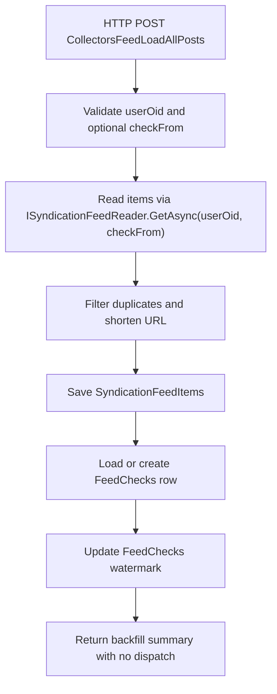

<!-- markdownlint-disable MD013 -->
# Feed collector: load all posts

This HTTP backfill collector reloads feed items for a specific owner starting from an optional date. It saves unique posts and updates the feed checkpoint, but it does not dispatch anything to publisher queues.

## Flow

## Key components

- [`LoadAllPosts`](../../src/JosephGuadagno.Broadcasting.Functions/Collectors/SyndicationFeed/LoadAllPosts.cs)
- [`ISyndicationFeedReader`](../../src/JosephGuadagno.Broadcasting.SyndicationFeedReader/Interfaces/ISyndicationFeedReader.cs)
- [`ISyndicationFeedItemManager`](../../src/JosephGuadagno.Broadcasting.Domain/Interfaces/ISyndicationFeedItemManager.cs)
- [`IFeedCheckManager`](../../src/JosephGuadagno.Broadcasting.Domain/Interfaces/IFeedCheckManager.cs)
- [`IUrlShortener`](../../src/JosephGuadagno.Broadcasting.Domain/Interfaces/IUrlShortener.cs)
- [`SyndicationFeedItems`](../../scripts/database/table-create.sql)
- [`FeedChecks`](../../scripts/database/table-create.sql)

## Related files

- [`LoadAllPosts.cs`](../../src/JosephGuadagno.Broadcasting.Functions/Collectors/SyndicationFeed/LoadAllPosts.cs)
- [`Settings.cs`](../../src/JosephGuadagno.Broadcasting.Functions/Models/Settings.cs)
