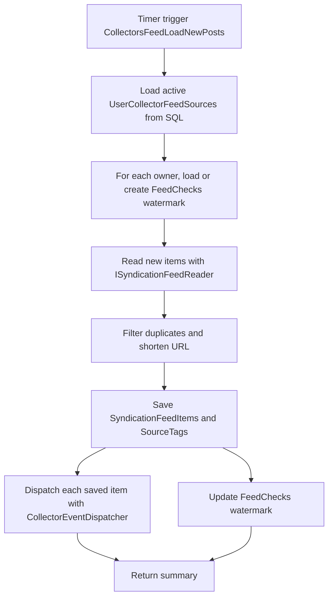

<!-- markdownlint-disable MD013 -->
# Feed collector: load new posts

This timer-driven collector polls every active user feed source and uses each owner's feed checkpoint to request only new content. It shortens URLs, saves unique posts to SQL, and hands each saved item to CollectorEventDispatcher for per-user queue routing.

## Flow

## Key components

- [`LoadNewPosts`](../../src/JosephGuadagno.Broadcasting.Functions/Collectors/SyndicationFeed/LoadNewPosts.cs)
- [`UserCollectorFeedSources`](../../scripts/database/table-create.sql)
- [`FeedChecks`](../../scripts/database/table-create.sql)
- [`ISyndicationFeedReader`](../../src/JosephGuadagno.Broadcasting.SyndicationFeedReader/Interfaces/ISyndicationFeedReader.cs)
- [`ISyndicationFeedItemManager`](../../src/JosephGuadagno.Broadcasting.Domain/Interfaces/ISyndicationFeedItemManager.cs)
- [`IUrlShortener`](../../src/JosephGuadagno.Broadcasting.Domain/Interfaces/IUrlShortener.cs)
- [`SyndicationFeedItems`](../../scripts/database/table-create.sql) and [`SourceTags`](../../scripts/database/table-create.sql)
- [`CollectorEventDispatcher`](../../src/JosephGuadagno.Broadcasting.Functions/Services/CollectorEventDispatcher.cs)
- [`UserEventDispatcherMappings`](../../scripts/database/table-create.sql)
- [`MessageTemplates`](../../scripts/database/table-create.sql)
- Azure Queue Storage platform queues

## Related files

- [`LoadNewPosts.cs`](../../src/JosephGuadagno.Broadcasting.Functions/Collectors/SyndicationFeed/LoadNewPosts.cs)
- [`CollectorEventDispatcher.cs`](../../src/JosephGuadagno.Broadcasting.Functions/Services/CollectorEventDispatcher.cs)
- [`Settings.cs`](../../src/JosephGuadagno.Broadcasting.Functions/Models/Settings.cs)
