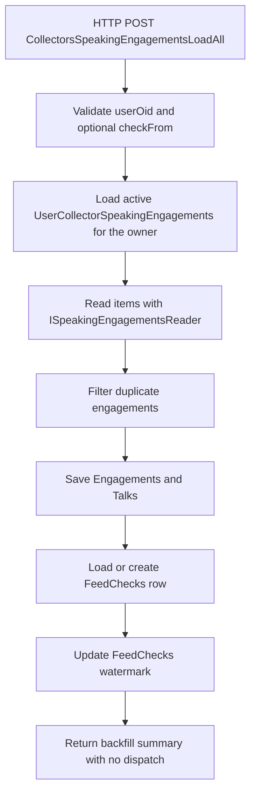

<!-- markdownlint-disable MD013 -->
# Speaking engagements collector: load all items

This HTTP backfill collector loads all active speaking engagement sources for one owner and imports entries from an optional starting date. It saves unique engagements and updates the watermark, but it stops before any publish dispatch.

## Flow

## Key components

- [`LoadAllSpeakingEngagements`](../../src/JosephGuadagno.Broadcasting.Functions/Collectors/SpeakingEngagement/LoadAllSpeakingEngagements.cs)
- [`UserCollectorSpeakingEngagements`](../../scripts/database/table-create.sql)
- [`ISpeakingEngagementsReader`](../../src/JosephGuadagno.Broadcasting.SpeakingEngagementsReader/Interfaces/ISpeakingEngagementsReader.cs)
- [`IEngagementManager`](../../src/JosephGuadagno.Broadcasting.Domain/Interfaces/IEngagementManager.cs)
- [`IFeedCheckManager`](../../src/JosephGuadagno.Broadcasting.Domain/Interfaces/IFeedCheckManager.cs)
- [`Engagements`](../../scripts/database/table-create.sql) and [`Talks`](../../scripts/database/table-create.sql)
- [`FeedChecks`](../../scripts/database/table-create.sql)

## Related files

- [`LoadAllSpeakingEngagements.cs`](../../src/JosephGuadagno.Broadcasting.Functions/Collectors/SpeakingEngagement/LoadAllSpeakingEngagements.cs)
