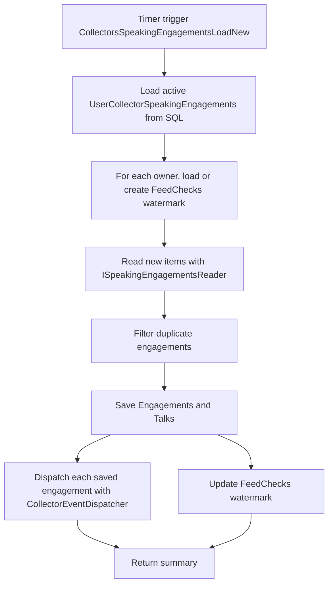

<!-- markdownlint-disable MD013 -->
# Speaking engagements collector: load new items

This timer-driven collector polls every active speaking engagements source and uses each owner's checkpoint to request only new or updated entries. It saves unique engagements, then routes each saved item through CollectorEventDispatcher for publisher-specific queue delivery.

## Flow

## Key components

- [`LoadNewSpeakingEngagements`](../../src/JosephGuadagno.Broadcasting.Functions/Collectors/SpeakingEngagement/LoadNewSpeakingEngagements.cs)
- [`UserCollectorSpeakingEngagements`](../../scripts/database/table-create.sql)
- [`FeedChecks`](../../scripts/database/table-create.sql)
- [`ISpeakingEngagementsReader`](../../src/JosephGuadagno.Broadcasting.SpeakingEngagementsReader/Interfaces/ISpeakingEngagementsReader.cs)
- [`IEngagementManager`](../../src/JosephGuadagno.Broadcasting.Domain/Interfaces/IEngagementManager.cs)
- [`Engagements`](../../scripts/database/table-create.sql) and [`Talks`](../../scripts/database/table-create.sql)
- [`CollectorEventDispatcher`](../../src/JosephGuadagno.Broadcasting.Functions/Services/CollectorEventDispatcher.cs)
- [`UserEventDispatcherMappings`](../../scripts/database/table-create.sql)
- [`MessageTemplates`](../../scripts/database/table-create.sql)
- Azure Queue Storage platform queues

## Related files

- [`LoadNewSpeakingEngagements.cs`](../../src/JosephGuadagno.Broadcasting.Functions/Collectors/SpeakingEngagement/LoadNewSpeakingEngagements.cs)
- [`CollectorEventDispatcher.cs`](../../src/JosephGuadagno.Broadcasting.Functions/Services/CollectorEventDispatcher.cs)
