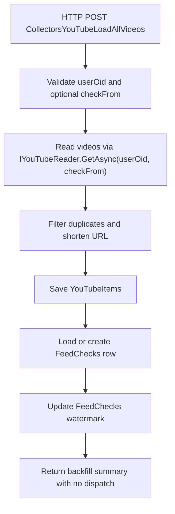

<!-- markdownlint-disable MD013 -->
# YouTube collector: load all videos

This HTTP backfill collector reloads videos for one owner from an optional starting date. It saves unique rows and updates the shared YouTube watermark, but it never calls the distributor service.

## Flow

## Key components

- [`LoadAllVideos`](../../src/JosephGuadagno.Broadcasting.Functions/Collectors/YouTube/LoadAllVideos.cs)
- [`IYouTubeReader`](../../src/JosephGuadagno.Broadcasting.YouTubeReader/Interfaces/IYouTubeReader.cs)
- [`IYouTubeItemManager`](../../src/JosephGuadagno.Broadcasting.Domain/Interfaces/IYouTubeItemManager.cs)
- [`IFeedCheckManager`](../../src/JosephGuadagno.Broadcasting.Domain/Interfaces/IFeedCheckManager.cs)
- [`IUrlShortener`](../../src/JosephGuadagno.Broadcasting.Domain/Interfaces/IUrlShortener.cs)
- [`YouTubeItems`](../../scripts/database/table-create.sql)
- [`FeedChecks`](../../scripts/database/table-create.sql)

## Related files

- [`LoadAllVideos.cs`](../../src/JosephGuadagno.Broadcasting.Functions/Collectors/YouTube/LoadAllVideos.cs)
- [`Settings.cs`](../../src/JosephGuadagno.Broadcasting.Functions/Models/Settings.cs)
