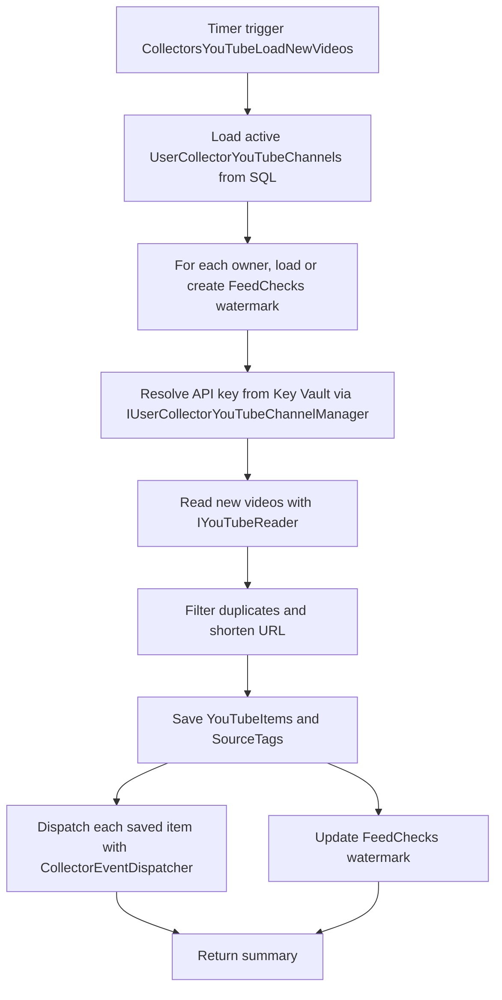

<!-- markdownlint-disable MD013 -->
# YouTube collector: load new videos

This timer-driven collector polls every active per-user YouTube channel configuration and uses the stored watermark to request only new videos. It resolves each owner's API key, saves unique videos to SQL, and routes saved items through CollectorEventDispatcher.

## Flow

## Key components

- [`LoadNewVideos`](../../src/JosephGuadagno.Broadcasting.Functions/Collectors/YouTube/LoadNewVideos.cs)
- [`UserCollectorYouTubeChannels`](../../scripts/database/table-create.sql)
- [`FeedChecks`](../../scripts/database/table-create.sql)
- [`IUserCollectorYouTubeChannelManager`](../../src/JosephGuadagno.Broadcasting.Domain/Interfaces/IUserCollectorYouTubeChannelManager.cs)
- [`IYouTubeReader`](../../src/JosephGuadagno.Broadcasting.YouTubeReader/Interfaces/IYouTubeReader.cs)
- [`IYouTubeItemManager`](../../src/JosephGuadagno.Broadcasting.Domain/Interfaces/IYouTubeItemManager.cs)
- [`IUrlShortener`](../../src/JosephGuadagno.Broadcasting.Domain/Interfaces/IUrlShortener.cs)
- [`YouTubeItems`](../../scripts/database/table-create.sql) and [`SourceTags`](../../scripts/database/table-create.sql)
- [`CollectorEventDispatcher`](../../src/JosephGuadagno.Broadcasting.Functions/Services/CollectorEventDispatcher.cs)
- [`UserEventDispatcherMappings`](../../scripts/database/table-create.sql)
- [`MessageTemplates`](../../scripts/database/table-create.sql)
- Azure Queue Storage platform queues

## Related files

- [`LoadNewVideos.cs`](../../src/JosephGuadagno.Broadcasting.Functions/Collectors/YouTube/LoadNewVideos.cs)
- [`CollectorEventDispatcher.cs`](../../src/JosephGuadagno.Broadcasting.Functions/Services/CollectorEventDispatcher.cs)
- [`Settings.cs`](../../src/JosephGuadagno.Broadcasting.Functions/Models/Settings.cs)
