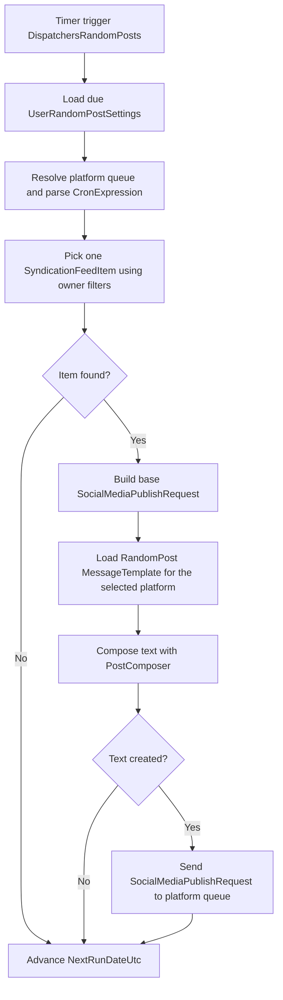

<!-- markdownlint-disable MD013 -->
# Random posts dispatcher

RandomPosts is a timer-driven dispatcher that works directly from per-user random-post settings instead of UserEventDispatcherMappings. For each due row, it selects one syndication item, renders a RandomPost template with PostComposer, enqueues the message, and advances NextRunDateUtc.

## Flow

## Key components

- [`RandomPosts`](../../src/JosephGuadagno.Broadcasting.Functions/Dispatchers/RandomPosts.cs)
- [`UserRandomPostSettings`](../../scripts/database/table-create.sql)
- [`SyndicationFeedItems`](../../scripts/database/table-create.sql)
- [`MessageTemplates`](../../scripts/database/table-create.sql)
- [`PostComposer`](../../src/JosephGuadagno.Broadcasting.Composers/PostComposer.cs)
- [`SocialMediaPublishRequest`](../../src/JosephGuadagno.Broadcasting.Domain/Models/SocialMediaPublishRequest.cs)
- QueueServiceClient
- NextRunDateUtc
- twitter-tweets-to-send
- bluesky-post-to-send
- linkedin-post-link
- facebook-post-status-to-page

## Related files

- [`RandomPosts.cs`](../../src/JosephGuadagno.Broadcasting.Functions/Dispatchers/RandomPosts.cs)
