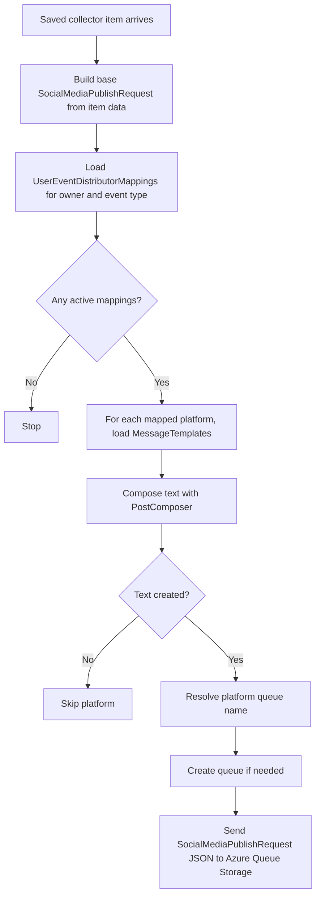

<!-- markdownlint-disable MD013 -->
# Collector event distributor

CollectorEventDistributor handles the fan-out after a collector saves a new feed item, video, or speaking engagement. It looks up the owner's active routing, renders platform-specific text with PostComposer, and writes a fresh SocialMediaPublishRequest to the correct queue.

## Flow

## Key components

- [`CollectorEventDistributor`](../../src/JosephGuadagno.Broadcasting.Functions/Services/CollectorEventDistributor.cs)
- [`UserEventDistributorMappings`](../../scripts/database/table-create.sql)
- [`MessageTemplates`](../../scripts/database/table-create.sql)
- [`PostComposer`](../../src/JosephGuadagno.Broadcasting.Composers/PostComposer.cs)
- [`SocialMediaPublishRequest`](../../src/JosephGuadagno.Broadcasting.Domain/Models/SocialMediaPublishRequest.cs)
- QueueServiceClient
- twitter-tweets-to-send
- bluesky-post-to-send
- linkedin-post-link
- facebook-post-status-to-page

## Related files

- [`CollectorEventDistributor.cs`](../../src/JosephGuadagno.Broadcasting.Functions/Services/CollectorEventDistributor.cs)
- [`LoadNewPosts.cs`](../../src/JosephGuadagno.Broadcasting.Functions/Collectors/SyndicationFeed/LoadNewPosts.cs)
- [`LoadNewVideos.cs`](../../src/JosephGuadagno.Broadcasting.Functions/Collectors/YouTube/LoadNewVideos.cs)
- [`LoadNewSpeakingEngagements.cs`](../../src/JosephGuadagno.Broadcasting.Functions/Collectors/SpeakingEngagement/LoadNewSpeakingEngagements.cs)
