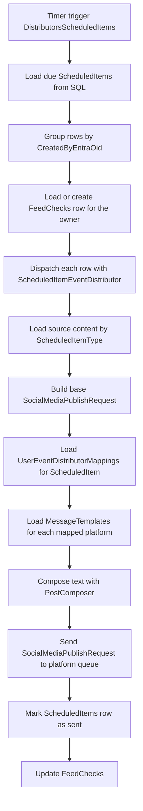

<!-- markdownlint-disable MD013 -->
# Scheduled items distributor

The scheduled items path starts with a timer that loads due ScheduledItems rows and groups them by owner. ScheduledItemEventDistributor then loads the referenced content, applies the owner's mappings and templates, and sends queue messages before the function marks the item as sent.

## Flow

## Key components

- [`ScheduledItems`](../../src/JosephGuadagno.Broadcasting.Functions/Distributors/ScheduledItems.cs)
- [`ScheduledItemEventDistributor`](../../src/JosephGuadagno.Broadcasting.Functions/Services/ScheduledItemEventDistributor.cs)
- [`ScheduledItems table`](../../scripts/database/table-create.sql)
- [`FeedChecks`](../../scripts/database/table-create.sql)
- [`SyndicationFeedItems`](../../scripts/database/table-create.sql)
- [`YouTubeItems`](../../scripts/database/table-create.sql)
- [`Engagements`](../../scripts/database/table-create.sql) and [`Talks`](../../scripts/database/table-create.sql)
- [`UserEventDistributorMappings`](../../scripts/database/table-create.sql)
- [`MessageTemplates`](../../scripts/database/table-create.sql)
- [`PostComposer`](../../src/JosephGuadagno.Broadcasting.Composers/PostComposer.cs)
- [`SocialMediaPublishRequest`](../../src/JosephGuadagno.Broadcasting.Domain/Models/SocialMediaPublishRequest.cs)
- Azure Queue Storage platform queues

## Related files

- [`ScheduledItems.cs`](../../src/JosephGuadagno.Broadcasting.Functions/Distributors/ScheduledItems.cs)
- [`ScheduledItemEventDistributor.cs`](../../src/JosephGuadagno.Broadcasting.Functions/Services/ScheduledItemEventDistributor.cs)
